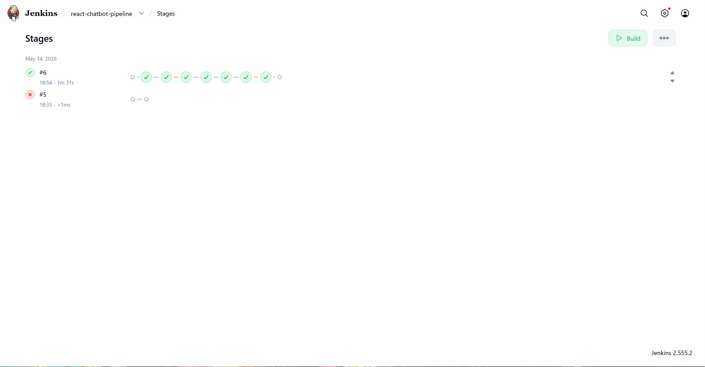
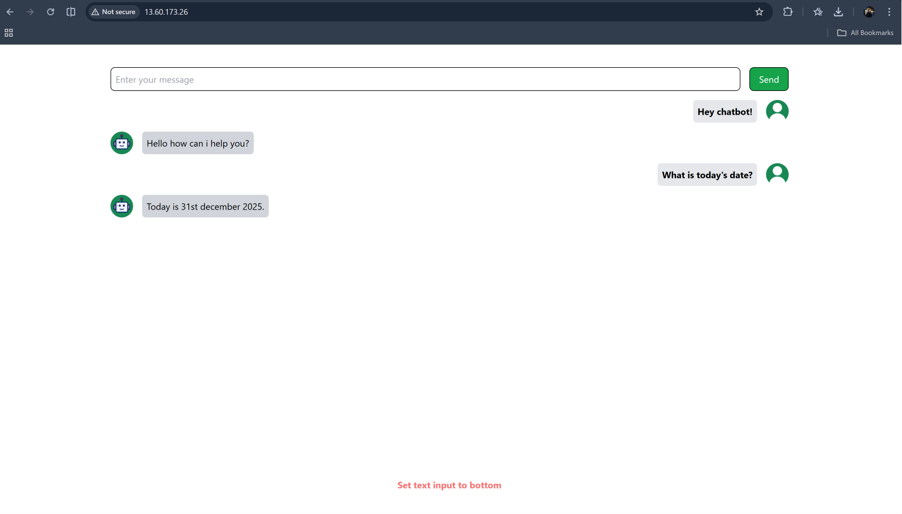
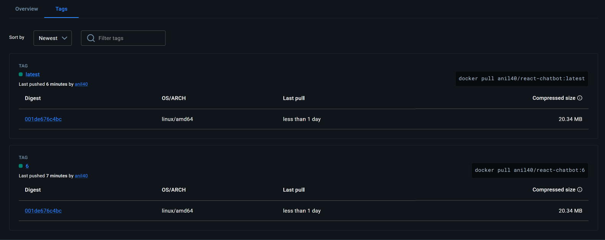

# React Chatbot with CI/CD Pipeline

A modern React-based chatbot application featuring a fully automated CI/CD pipeline using Jenkins, Docker, and AWS EC2.

## Project Overview

This project demonstrates a complete DevOps workflow:
1. **Frontend**: A React application built with Vite.
2. **Containerization**: A multi-stage Docker build that serves the compiled React app using Nginx.
3. **Continuous Integration**: Jenkins automatically builds the code and Docker image on every push.
4. **Health Validation**: The pipeline spins up a test container and validates the `/healthz` endpoint before proceeding.
5. **Continuous Deployment**: The validated Docker image is pushed to Docker Hub and automatically deployed to an AWS EC2 instance.

## Technologies Used

- **Frontend**: React.js, Vite
- **CI/CD**: Jenkins
- **Containerization**: Docker, Docker Hub
- **Web Server**: Nginx
- **Cloud Hosting**: AWS EC2

## CI/CD Pipeline Architecture

The declarative `Jenkinsfile` defines the following stages:
1. **Build Frontend**: Installs dependencies (`npm ci`) and builds the React app (`npm run build`).
2. **Build Docker Image**: Creates a versioned Docker image and tags it as `latest`.
3. **Validate Container Health**: Runs a temporary local container to test the HTTP health endpoint.
4. **Push Image**: Authenticates with Docker Hub and pushes the new image.
5. **Deploy to EC2**: Connects to the AWS EC2 instance via SSH, pulls the latest image, and restarts the container on port 80.

## Local Setup

To run this project locally using Docker:

```bash
# Build the image
docker build -t react-chatbot .

# Run the container
docker run -d -p 8080:80 --name react-chatbot react-chatbot
```
Access the application at `http://localhost:8080`.

---

## Project Validation & Screenshots

### 1. Jenkins Pipeline (All Stages Successful)


### 2. Live Application on AWS EC2


### 3. Docker Hub Image Registry

